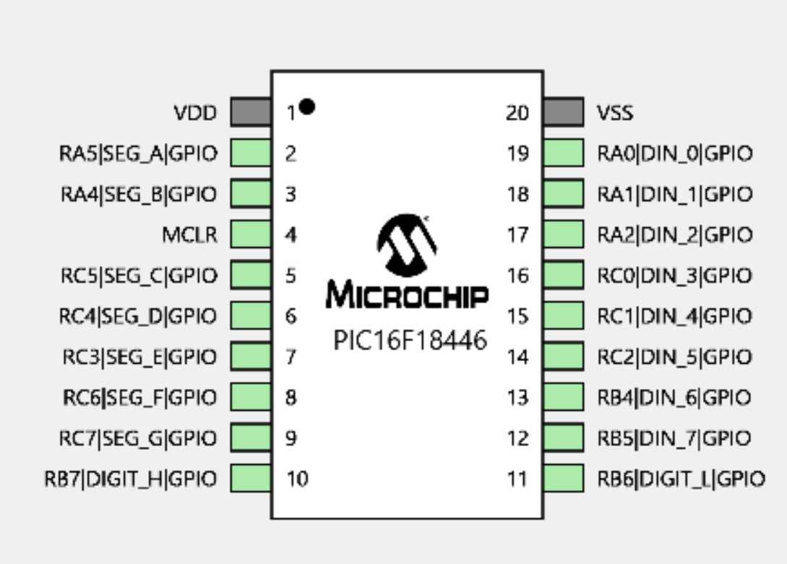
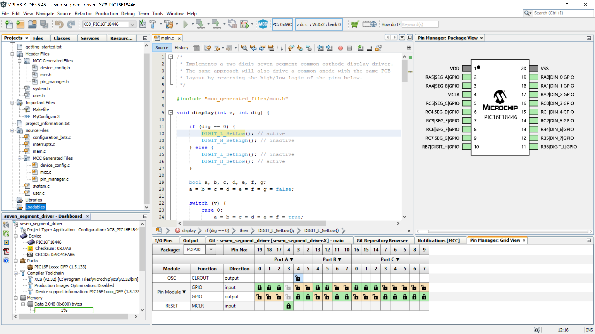
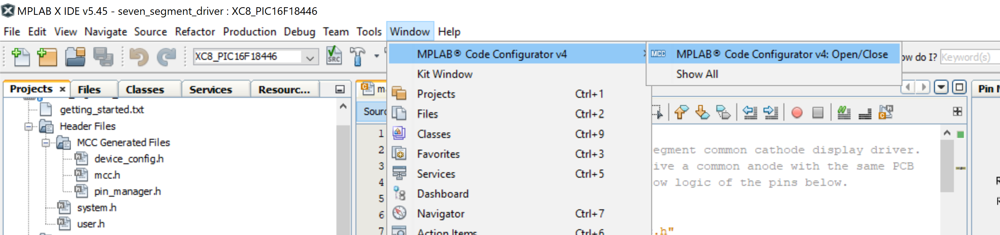

# SevenSegmentModule

This project is a two digit seven segment display module driver using a PIC microcontroller PIC16F18446.

Whilst the chip has great capabilities I'm using a tiny part of it's capability. I'm building this module for use in a homebrew TTL CPU that I'm building called SPAM-1, and you can see the SPAM-1 git repo in my repository but also take a look at it's youtube videos and the Hackaday project. Ironically this microcontroller has vastly more power than my massive homebrew TTL CPU.

This IC has a load of GPIO pins for such a small device. Its a 20 pin package and apart from power there is only one pin _MCLR_ (reset) that can't be configured as input or output. 

Looking at the data sheet this device has pretty good current limits on it's GPIO pins but I'm going to be current limiting crudely using a resistor on the common cathode of the seven segment LEDs. I'll end up taking only a few mA. 

The device pinout is shown below. I've labelled the pins as DIN_0-7 for the 8 bit input and SEG A-G for the segment outputs, and also DIGIT_L and DIGIT_H to select which of the to digits will be lit. The Segment signals are multiplexed on two 7 segment displays by the common cathodes of the two displays being controlled by DIGIT_L and _H.

Project Structure
----

The user code is in [_main.c_](https://raw.githubusercontent.com/Johnlon/SevenSegmentModule/main/main.c).

This is a straightforward loop that reads the 8 bit data input and then decides which of the seven segment output bits to turn on/off to light the LED's, and also it multiplexes the two digits by applying a low to the DIGIT_L or DIGIT_H pins to select which digit is lit (low to light the digit).

The rest of the files are mostly generated.

The code generation is driven by the MPLab Configurator app that is accessible from the menus.

Using the pin configurator "Pin Manager" grid shown at the bottom of the IDE in the image below, I set the pins as being GPIO inputs or outputs.

Once the config has been decided the hit the _Generate_ button to recreate the config code.

I used the facilities shown below to setup the config. I used the "Pin Module" to uncheck "Analog" on all pins and then renamed the pins to the symbolic names that represents their function. These names show up in the generated code, for example _SEG_A_ for segment 'A'. I also set the two multiplexing pins to start with logic high. This is so that the two digits will be unlit until the microcontroller starts it's program loop.

Hardware
------

To follow.

I'll use EasyEDA to setup the PCB and then get them made up by a PCB fab company.
